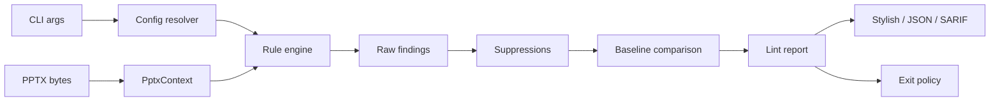

# pptxlint v0.1 architecture

## 1. High-level decisions

| Area        | Decision                                                   |
| ----------- | ---------------------------------------------------------- |
| Runtime     | Node.js 22 or 24, TypeScript strict                        |
| Workspace   | pnpm                                                       |
| Packages    | `@pptxlint/core` and CLI package/binary `pptxlint`         |
| Tests       | Vitest + synthetic PPTX fixture builder                    |
| Config      | versioned JSON schema, no executable JS config             |
| Output      | stylish, versioned JSON, SARIF 2.1.0                       |
| Execution   | local/offline, without PowerPoint, LibreOffice, or network |
| Persistence | optional baseline JSON only; PPTX files are never uploaded |

ZIP and XML libraries are wrapped by internal adapters; rule code never imports
third-party parsers directly. The choice of `@zip.js/zip.js` and
`@rgrove/parse-xml`, including security settings and alternatives, is recorded in
[ADR 0001](adr/0001-zip-xml-adapters.md).

Normative sources:

- [ECMA-376, including Open Packaging Conventions](https://ecma-international.org/publications-and-standards/standards/ecma-376/);
- [Microsoft: Structure of a PresentationML document](https://learn.microsoft.com/en-us/office/open-xml/presentation/structure-of-a-presentationml-document).

## 2. Architectural flow



Separation of responsibilities:

- core owns parsing, modeling, rules, fingerprints, and report data;
- CLI owns filesystem access, config discovery, stdout/stderr, and exit codes;
- formatters receive a completed report and do not recompute findings;
- baseline/suppressions change finding status without destroying raw evidence.

## 3. Workspace structure

```text
packages/
  core/
    src/archive/
    src/xml/
    src/content-types/
    src/relationships/
    src/presentation/
    src/geometry/
    src/text/
    src/rules/
      package/
      layout/
      text/
      fonts/
    src/config/
    src/suppressions/
    src/baseline/
    src/report/
    src/types/
  cli/
    src/commands/
    src/formatters/
    src/io/
fixtures/
  builders/
  templates/
  generated/
docs/
```

`packages/core` does not import the CLI, filesystem temp APIs, or terminal
coloring. Core accepts bytes and validated config. The CLI may depend on core,
but core must not depend on the CLI.

## 4. Public core API

```ts
interface LintInput {
  bytes: Uint8Array;
  displayPath: string;
  inputKey: string;
}

interface LintOptions {
  config: ResolvedConfig;
  baseline?: Baseline;
}

async function lintPptx(
  input: LintInput,
  options: LintOptions,
): Promise<LintReport>;
```

`displayPath` is used in the report. `inputKey` is a normalized relative key for
fingerprints/baselines. Absolute paths are excluded from deterministic output.
For inputs outside the current working directory, the CLI keeps only the
basename in `displayPath` and constructs `inputKey` as
`external/<sha256-normalized-relative-logical-path>/<basename>`. This conceals
the local path, keeps distinct external files with identical basenames separate,
and remains stable across checkout paths with the same structure relative to
the current working directory. If the filesystem cannot construct a relative
path between volumes, the CLI rejects the input instead of including a
machine-specific absolute path in the key. Only the current platform's separator
is normalized in the logical path; literal backslash, percent, and colon
characters within a component are encoded before hashing, so POSIX names `a\\b`
and `a/b` do not collide.

## 5. Package model

### 5.1 Canonical part names

Internal representation of a ZIP part name:

```text
ppt/slides/slide1.xml
```

No leading `/`; only `/` separators. The raw name is preserved as evidence.
Normalization must not conceal duplicates or ambiguous names.

Invalid entry:

- absolute/drive-prefixed path;
- backslash separator;
- NUL;
- traversal above the package root;
- canonical conflict with an entry already encountered.

### 5.2 ArchiveIndex

```ts
interface ArchiveEntryDescriptor {
  name: string;
  rawName: string;
  compressedSize: number;
  uncompressedSize: number;
  crc32?: number;
}

interface ArchiveIndex {
  list(): readonly ArchiveEntryDescriptor[];
  has(partName: string): boolean;
  read(partName: string): Promise<Uint8Array>;
  duplicates(): readonly string[];
}
```

Entries are indexed in one pass. Payloads are read lazily and cached.
Limits apply before allocating the full uncompressed buffer.

### 5.3 XmlPartStore

```ts
type XmlPartResult =
  | { ok: true; document: XmlDocument }
  | { ok: false; diagnostic: XmlParseDiagnostic };

interface XmlPartStore {
  get(partName: string): Promise<XmlPartResult>;
  knownXmlParts(): readonly string[];
}
```

The parser is namespace-aware, rejects DTD/entities, and returns parse failures
as data. Each part is parsed at most once per analysis.

### 5.4 RelationshipGraph

A relationship stores the source part, `.rels` part, rId/type, target mode, raw
target, and resolved target. Internal targets are resolved relative to the source
part according to OPC. External targets are never fetched.

Incoming/outgoing indexes support missing-media checks and presentation
traversal. `package/broken-relationship` excludes media relationship types,
which belong to the specialized rule.

### 5.5 PresentationIndex

- Slide order follows `p:sldIdLst` + presentation relationships, not filenames
  such as `slide1.xml`.
- Slide → layout → master → theme links are built through the graph.
- Slide number, persistent slide ID, part name, and shape IDs are available to rules.
- Missing/malformed prerequisites produce partial context and
  `analysisComplete: false` rather than cascading exceptions.

## 6. Geometry model

### 6.1 Coordinate system

Source geometry is stored in EMU. Transformed geometry uses an affine matrix,
while evidence retains both EMU and convenient points/ratios.

```ts
interface ShapeGeometry {
  slideNumber: number;
  slideId: string;
  shapeId: number;
  shapeName?: string;
  zIndex: number;
  polygon: readonly Point[];
  bbox: Rectangle;
  hasVisibleText: boolean;
  opacity: OpacityEvidence;
}
```

### 6.2 Transforms

The resolver accounts for:

- shape offset/extent;
- nested group `off/ext/chOff/chExt` transforms;
- flips;
- rotation;
- placeholder geometry inheritance through slide → layout → master;
- `p:cNvPr@hidden`, including hidden group subtrees;
- slide size from the presentation part.

For rotated rectangles, overlap/outside calculations use the transformed polygon
rather than only the original axis-aligned box. All pair IDs are sorted before
fingerprinting.

### 6.3 Scope v0.1

Layout rules analyze locally authored shapes on the slide. Inherited layout/master
decorations are indexed for style resolution but do not participate in
overlap/outside findings. This reduces false positives and is explicitly stated
in rule documentation.

`layout/text-occluded` evaluates coverage of the text-frame polygon rather than
individual rendered glyphs. Messages and evidence must not describe this result
as pixel-perfect occlusion.

## 7. Text and font resolution

### 7.1 EffectiveTextStyleResolver

The resolver returns both the value and its provenance:

```ts
type ResolvedValue<T> =
  | { status: "resolved"; value: T; sourcePart: string; sourceKind: string }
  | { status: "unresolved"; reason: string };

interface EffectiveRunStyle {
  fontSizePt: ResolvedValue<number>;
  typeface: {
    latin: ResolvedValue<string>;
    eastAsian: ResolvedValue<string>;
    complexScript: ResolvedValue<string>;
  };
  placeholderKind?: "title" | "body" | "other";
  autofit: AutofitState;
}
```

The style chain supports documented run/paragraph/list/shape, placeholder
layout/master, and presentation defaults. Theme placeholders are resolved
through the reachable theme. XML namespace prefixes are not used as identifiers;
only namespace URI + local name are used.

`fontScale` accepts both normative lexical forms: an integer in thousandths of
a percent and a percent string with a `%` suffix. Supplemental theme fonts are
selected by ISO 15924 script tag. Han uses language metadata; without it, the
result is resolved only when both `Hans` and `Hant` are defined and identify the
same typeface. A `themeOverride` relationship on a slide or layout conservatively
makes theme-placeholder results unresolved until merging the base theme with
its override is implemented.

If the chain is ambiguous or contains an unsupported construct, the resolver
returns `unresolved`. Rules do not substitute an arbitrary 18pt size or system font.

### 7.2 Autofit

States:

```ts
type AutofitState =
  | { kind: "none" }
  | { kind: "shape-to-fit-text" }
  | { kind: "runtime"; persistedScaleRatio?: number }
  | { kind: "unknown"; reason: string };
```

When a stored scale is present and valid, effective size is computed as resolved
base size × normalized scale ratio. Raw OOXML units are normalized according to
the specification and verified by fixtures, without guessed constants.

If runtime autofit is enabled but no persisted scale is available, only
`text/autofit-enabled` is produced. Text layout is not simulated again.

### 7.3 Duplicate prevention

- Run with a below-minimum base size and no usable autofit scale →
  `text/min-font-size`.
- Run with a base size above the minimum but a stored scale that reduces effective
  size below it → `text/autofit-scale-below-minimum`.
- Shape with runtime autofit and no usable scale → `text/autofit-enabled`.
- For the same run/shape, the specialized autofit finding takes precedence over
  the generic minimum finding.

## 8. Rule engine

```ts
interface RuleDescriptor<Options> {
  id: RuleId;
  defaultSeverity: Severity | "off";
  prerequisites: ContextCapability[];
  optionsSchema: Schema<Options>;
}

interface PptxLintRule<Options> {
  descriptor: RuleDescriptor<Options>;
  analyze(
    context: PptxContext,
    options: Options,
  ): Promise<readonly FindingDraft[]>;
}
```

The engine performs:

1. prerequisite check;
2. rules in stable registry order;
3. canonical evidence/location;
4. fingerprint generation;
5. specialization deduplication;
6. deterministic sort;
7. severity override from config.

Rules do not read the filesystem, open ZIP archives independently, print output,
or decide the exit code.

## 9. Configuration architecture

V0.1 supports JSON only:

- explicit `--config path`;
- otherwise, search upward from the current working directory for `.pptxlintrc.json`;
- one resolved config applies to all input files in the command;
- built-in preset `recommended`;
- CLI `--fail-on` overrides the config gate.

Config is loaded and fully validated before reading PPTX files. Unknown rules,
unknown options, or invalid severities return exit code 2.

```ts
interface ResolvedRuleConfig<T> {
  enabled: boolean;
  severity: Severity;
  options: T;
}

interface ResolvedConfig {
  schemaVersion: 1;
  failOn: Severity;
  rules: ReadonlyMap<RuleId, ResolvedRuleConfig<unknown>>;
  ignore: readonly Suppression[];
}
```

## 10. Suppressions

The suppression matcher runs after raw rule results and before baseline comparison.

Selectors v0.1:

- rule ID;
- input relative path, optional;
- slide number or persistent slide ID, optional;
- one or more shape IDs, optional;
- part name, optional.

A suppression must contain a rule ID and at least one location selector. Shape
IDs and pair IDs are canonicalized. Matching is exact: regex/fuzzy text matching
is unsupported.

`ignore[].file` is a raw logical path relative to the CLI working directory. `/`
is always a portable separator; `\` is a separator only on Windows and is a
valid literal filename character on POSIX. The config parser and CLI resolver
share `encodeInputKeyPath`: percent, colon, and literal backslash are encoded as
`%25`, `%3A`, and `%5C` before exact matching. Users do not enter these escape
sequences manually. The CLI resolves `..` for external inputs and passes
`resolveConfig` the same filesystem-aware resolver used to construct the actual
input's `inputKey`. The programmatic core API does not implicitly select a
platform separator: when `ignore[].file` is present, the caller must provide
`ResolveConfigOptions.resolveFileInputKey`, which returns the canonical `inputKey`.

```ts
interface SuppressedFinding {
  finding: PptxFinding;
  suppressionIndex: number;
  reason?: string;
}
```

Unused suppressions are returned as report metadata to prevent obsolete
exceptions from accumulating in config. A suppression with an explicit `file`
that does not match the current `inputKey` is outside that input's scope and is
not considered unused. In v0.1, unused suppressions are not separate lint findings.

## 11. Baseline model

```ts
interface BaselineV3 {
  schemaVersion: 3;
  toolMajorVersion: number;
  inputs: Array<{
    inputKey: string;
    findings: Array<{
      fingerprint: string;
      ruleId: RuleId;
      location: FindingLocation;
    }>;
  }>;
}
```

The baseline is written after config suppressions. Comparison uses exact
fingerprint matching:

- current + baseline → existing;
- current only → new;
- baseline only → resolved.

Only new findings affect exit policy. An incompatible schema/tool major version
is an explicit config/baseline error. Baseline JSON is sorted deterministically
and excludes extracted slide text. Reports with the same `inputKey` but different
source SHA-256 values are not merged. The CLI checks baseline and input filesystem
identity through canonical paths and device/inode, then writes the baseline to
a temporary file in the same directory and atomically replaces the destination
using rename.

## 12. Report and formatters

```ts
interface LintReport {
  schemaVersion: 1;
  toolVersion: string;
  configHash: string;
  analysisComplete: boolean;
  inputs: InputReport[];
  summary: {
    new: SeverityCounts;
    existing: SeverityCounts;
    resolved: number;
    suppressed: number;
  };
  timingsMs: Record<string, number>;
  peakRssBytes?: number;
}
```

Without `--debug`, timings remain empty and peak RSS is omitted, keeping unstable
performance measurements out of default machine output. Debug mode aggregates
context/rule timings across all inputs in the command.

Formatters are pure transformations:

- stylish writes human-readable output;
- JSON serializes the versioned report contract;
- SARIF converts findings, rules, and fingerprints to SARIF 2.1.0.

SARIF location:

- `.pptx` path → physical artifact URI;
- slide/shape → logical location and properties;
- fingerprint → partial fingerprint.

Because `.pptx` is a binary artifact, SARIF v0.1 does not promise line-level inline
annotations or slide previews. These belong to a future GitHub Check/App.

## 13. Exit policy

```ts
function determineExitCode(report: LintReport, failOn: Severity): 0 | 1 | 2;
```

- Code 2 is determined by command/config/input/internal errors outside the normal report.
- Code 1 applies when at least one **new**, unsuppressed finding has severity at
  or above `failOn`.
- Existing baseline findings and suppressed findings do not affect the exit code.
- `analysisComplete: false` alone does not change the code if its cause is already
  represented by a gating or explicitly suppressed package finding. A suppressed
  finding serves only as an explanation and does not become gating. Unexplained
  incomplete analysis is an internal error/code 2.

## 14. Determinism contract

Identical input bytes, resolved config, baseline, and tool version must produce:

- identical rule results and fingerprints;
- identical ordering of inputs/findings/evidence arrays;
- identical JSON/SARIF except for explicitly documented timings;
- identical exit codes.

Fingerprints and default output must exclude:

- absolute filesystem paths;
- ZIP enumeration order without canonical sorting;
- current timestamp;
- locale-dependent number/string formatting;
- random UUIDs;
- system font inventory.

## 15. Security limits

Defaults are configurable in core but cannot be disabled entirely:

| Limit                            | Initial default |
| -------------------------------- | --------------: |
| ZIP entries                      |          10,000 |
| declared total uncompressed size |           1 GiB |
| one uncompressed entry           |         256 MiB |
| one XML part                     |          20 MiB |
| compression ratio per entry      |           200:1 |

Additional requirements:

- enforce actual decompressed byte limits, not just ZIP metadata limits;
- prohibit DTD/entities;
- never fetch external relationships;
- never materialize path traversal on the filesystem;
- omit full slide text from logs/output by default;
- keep input files read-only and never overwrite them.

## 16. Error boundaries

- `CliUsageError`: invalid arguments, code 2.
- `ConfigError`: config/schema/baseline invalid, code 2.
- `UnsupportedInputError`: non-ZIP/PPTX, encrypted, or `.pptm` input, code 2.
- `PackageFinding`: broken relationship/missing media/malformed XML, normal
  lint result.
- `InternalError`: bug with a concise stderr message; stack traces are excluded
  from v0.1 CLI output.

## 17. Deferred architecture

The following components are not created in the v0.1 workspace:

- API/web apps;
- database/temp result storage;
- repair transaction;
- renderer/thumbnail service;
- GitHub App/Check integration;
- hosted organization policy/history.

Core contracts are designed to allow these consumers to be added later, but
speculative abstractions for them are not implemented in advance.
