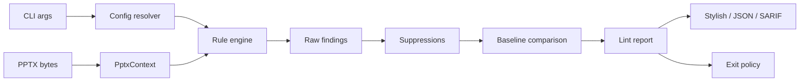

# Архитектура pptxlint v0.1

## 1. Решения верхнего уровня

| Область     | Решение                                                   |
| ----------- | --------------------------------------------------------- |
| Runtime     | Node.js 22 or 24, TypeScript strict                       |
| Workspace   | pnpm                                                      |
| Packages    | `@pptxlint/core` и CLI package/binary `pptxlint`          |
| Tests       | Vitest + synthetic PPTX fixture builder                   |
| Config      | versioned JSON schema, без executable JS config           |
| Output      | stylish, versioned JSON, SARIF 2.1.0                      |
| Execution   | local/offline, без PowerPoint, LibreOffice и network      |
| Persistence | только optional baseline JSON; PPTX никуда не загружается |

ZIP и XML libraries скрываются за internal adapters; rule code не импортирует
сторонний parser напрямую. Выбор `@zip.js/zip.js` и `@rgrove/parse-xml`, включая
security settings и alternatives, зафиксирован в
[ADR 0001](adr/0001-zip-xml-adapters.md).

Нормативные источники:

- [ECMA-376, включая Open Packaging Conventions](https://ecma-international.org/publications-and-standards/standards/ecma-376/);
- [Microsoft: Structure of a PresentationML document](https://learn.microsoft.com/en-us/office/open-xml/presentation/structure-of-a-presentationml-document).

## 2. Архитектурный поток



Ключевое разделение:

- core отвечает за parsing, modeling, rules, fingerprints и report data;
- CLI отвечает за filesystem, config discovery, stdout/stderr и exit codes;
- formatters получают готовый report и не пересчитывают findings;
- baseline/suppressions меняют status finding, но не уничтожают raw evidence.

## 3. Структура workspace

```text
packages/
  core/
    src/archive/
    src/xml/
    src/content-types/
    src/relationships/
    src/presentation/
    src/geometry/
    src/text/
    src/rules/
      package/
      layout/
      text/
      fonts/
    src/config/
    src/suppressions/
    src/baseline/
    src/report/
    src/types/
  cli/
    src/commands/
    src/formatters/
    src/io/
fixtures/
  builders/
  templates/
  generated/
docs/
```

`packages/core` не импортирует CLI, filesystem temp APIs или terminal coloring.
Core принимает bytes и validated config. CLI может зависеть от core, но не
наоборот.

## 4. Public core API

```ts
interface LintInput {
  bytes: Uint8Array;
  displayPath: string;
  inputKey: string;
}

interface LintOptions {
  config: ResolvedConfig;
  baseline?: Baseline;
}

async function lintPptx(
  input: LintInput,
  options: LintOptions,
): Promise<LintReport>;
```

`displayPath` используется в report. `inputKey` — нормализованный относительный
ключ для fingerprints/baseline. Абсолютный путь не попадает в deterministic
output. Для входа вне current working directory CLI оставляет в `displayPath`
только basename, а `inputKey` строит как
`external/<sha256-normalized-relative-logical-path>/<basename>`. Это не
раскрывает локальный путь, не объединяет разные внешние файлы с одинаковым
basename и остаётся стабильным между checkout paths при одинаковой структуре
относительно current working directory. Если filesystem не может построить
relative path между разными volumes, CLI отклоняет input вместо включения
machine-specific absolute path в key. В logical path нормализуется только
separator текущей платформы; literal backslash, percent и colon внутри
компонента кодируются до hashing, поэтому POSIX names `a\\b` и `a/b` не
коллидируют.

## 5. Package model

### 5.1 Canonical part names

Внутреннее представление ZIP part name:

```text
ppt/slides/slide1.xml
```

Без начального `/`, только с `/` separator. Raw name сохраняется для evidence.
Нормализация не должна скрывать duplicates или ambiguous names.

Invalid entry:

- absolute/drive-prefixed path;
- backslash separator;
- NUL;
- traversal выше package root;
- canonical conflict с ранее увиденным entry.

### 5.2 ArchiveIndex

```ts
interface ArchiveEntryDescriptor {
  name: string;
  rawName: string;
  compressedSize: number;
  uncompressedSize: number;
  crc32?: number;
}

interface ArchiveIndex {
  list(): readonly ArchiveEntryDescriptor[];
  has(partName: string): boolean;
  read(partName: string): Promise<Uint8Array>;
  duplicates(): readonly string[];
}
```

Entries индексируются одним проходом. Payload читается лениво и кешируется.
Limits применяются до аллокации полного uncompressed buffer.

### 5.3 XmlPartStore

```ts
type XmlPartResult =
  | { ok: true; document: XmlDocument }
  | { ok: false; diagnostic: XmlParseDiagnostic };

interface XmlPartStore {
  get(partName: string): Promise<XmlPartResult>;
  knownXmlParts(): readonly string[];
}
```

Parser namespace-aware, отклоняет DTD/entities и возвращает parse failure как
data. Один part парсится не более одного раза за analysis.

### 5.4 RelationshipGraph

Relationship хранит source part, `.rels` part, rId/type, target mode, raw target
и resolved target. Internal target разрешается относительно source part по OPC.
External target не fetch-ится.

Incoming/outgoing indexes используются для missing-media и presentation
traversal. `package/broken-relationship` исключает media relationship types,
которые принадлежат специализированному rule.

### 5.5 PresentationIndex

- Slide order строится по `p:sldIdLst` + presentation relationships, а не по
  именам `slide1.xml`.
- Slide → layout → master → theme связи строятся через graph.
- Slide number, persistent slide ID, part name и shape IDs доступны rules.
- Missing/malformed prerequisite создаёт partial context и
  `analysisComplete: false`, а не cascade exceptions.

## 6. Geometry model

### 6.1 Coordinate system

Source geometry хранится в EMU. Для transformed geometry используется affine
matrix, но evidence сохраняет и EMU, и удобные points/ratios.

```ts
interface ShapeGeometry {
  slideNumber: number;
  slideId: string;
  shapeId: number;
  shapeName?: string;
  zIndex: number;
  polygon: readonly Point[];
  bbox: Rectangle;
  hasVisibleText: boolean;
  opacity: OpacityEvidence;
}
```

### 6.2 Transforms

Resolver учитывает:

- shape offset/extent;
- nested group `off/ext/chOff/chExt` transforms;
- flips;
- rotation;
- placeholder geometry inheritance через slide → layout → master;
- `p:cNvPr@hidden`, включая скрытые group subtrees;
- slide size из presentation part.

Для rotated rectangles overlap/outside рассчитываются по transformed polygon,
а не только по исходному axis-aligned box. Все pair IDs сортируются до
fingerprinting.

### 6.3 Scope v0.1

Layout rules анализируют locally-authored shapes на slide. Inherited
layout/master decorations индексируются для style resolution, но не участвуют в
overlap/outside findings. Это снижает false positives и явно отражается в rule
documentation.

`layout/text-occluded` оценивает перекрытие text-frame polygon, а не отдельных
нарисованных glyphs. Message и evidence не должны называть этот результат
pixel-perfect occlusion.

## 7. Text and font resolution

### 7.1 EffectiveTextStyleResolver

Resolver возвращает не только value, но и provenance:

```ts
type ResolvedValue<T> =
  | { status: "resolved"; value: T; sourcePart: string; sourceKind: string }
  | { status: "unresolved"; reason: string };

interface EffectiveRunStyle {
  fontSizePt: ResolvedValue<number>;
  typeface: {
    latin: ResolvedValue<string>;
    eastAsian: ResolvedValue<string>;
    complexScript: ResolvedValue<string>;
  };
  placeholderKind?: "title" | "body" | "other";
  autofit: AutofitState;
}
```

Style chain поддерживает задокументированные run/paragraph/list/shape,
placeholder layout/master и presentation defaults. Theme placeholders
разрешаются через reachable theme. Prefix XML namespace не используется как
идентификатор — только namespace URI + local name.

`fontScale` принимает обе нормативные lexical-формы: integer в тысячных долях
процента и percent string с суффиксом `%`. Supplemental theme fonts выбираются
по ISO 15924 script tag; для Han используются language metadata, а без них
результат считается resolved только когда `Hans` и `Hant` заданы и указывают на
один typeface. Наличие `themeOverride` relationship у slide или layout
консервативно делает theme-placeholder result unresolved, пока объединение base
theme с override не реализовано.

Если chain неоднозначен или содержит неподдержанную конструкцию, resolver
возвращает `unresolved`. Rule не подставляет условные 18pt или системный font.

### 7.2 Autofit

Состояния:

```ts
type AutofitState =
  | { kind: "none" }
  | { kind: "shape-to-fit-text" }
  | { kind: "runtime"; persistedScaleRatio?: number }
  | { kind: "unknown"; reason: string };
```

Если сохранённый scale присутствует и валиден, effective size вычисляется как
resolved base size × normalized scale ratio. Нормализация raw OOXML units
реализуется по спецификации и подтверждается fixtures, а не guessed constants.

Если runtime autofit включён, но persisted scale недоступен, создаётся только
`text/autofit-enabled`. Text layout заново не симулируется.

### 7.3 Duplicate prevention

- Run с below-minimum base size без usable autofit scale →
  `text/min-font-size`.
- Run с base size выше minimum, но stored scale опускает effective size ниже →
  `text/autofit-scale-below-minimum`.
- Shape с runtime autofit без usable scale → `text/autofit-enabled`.
- Для одного run/shape специализированный autofit finding имеет приоритет над
  generic minimum finding.

## 8. Rule engine

```ts
interface RuleDescriptor<Options> {
  id: RuleId;
  defaultSeverity: Severity | "off";
  prerequisites: ContextCapability[];
  optionsSchema: Schema<Options>;
}

interface PptxLintRule<Options> {
  descriptor: RuleDescriptor<Options>;
  analyze(
    context: PptxContext,
    options: Options,
  ): Promise<readonly FindingDraft[]>;
}
```

Engine выполняет:

1. prerequisite check;
2. rules в стабильном registry order;
3. canonical evidence/location;
4. fingerprint generation;
5. specialization deduplication;
6. deterministic sort;
7. severity override из config.

Rule не читает filesystem, не открывает ZIP самостоятельно, не печатает output
и не принимает решение об exit code.

## 9. Configuration architecture

V0.1 поддерживает только JSON:

- explicit `--config path`;
- иначе поиск `.pptxlintrc.json` от current working directory вверх;
- один resolved config применяется ко всем input files команды;
- built-in preset `recommended`;
- CLI `--fail-on` переопределяет config gate.

Config загружается и полностью валидируется до чтения PPTX. Unknown rule,
unknown option или invalid severity возвращают exit code 2.

```ts
interface ResolvedRuleConfig<T> {
  enabled: boolean;
  severity: Severity;
  options: T;
}

interface ResolvedConfig {
  schemaVersion: 1;
  failOn: Severity;
  rules: ReadonlyMap<RuleId, ResolvedRuleConfig<unknown>>;
  ignore: readonly Suppression[];
}
```

## 10. Suppressions

Suppression matcher работает после raw rule results, но до baseline.

Selectors v0.1:

- rule ID;
- input relative path, optional;
- slide number или persistent slide ID, optional;
- one or more shape IDs, optional;
- part name, optional.

Suppression должен содержать rule ID и хотя бы один location selector. Shape IDs
и pair IDs canonicalized. Matching exact: regex/fuzzy text matching не
поддерживается.

`ignore[].file` — raw logical path относительно CLI working directory. `/`
всегда является portable separator, а `\` считается separator только на
Windows; на POSIX это допустимый literal filename character. Config parser и
CLI resolver использует общий `encodeInputKeyPath`: percent, colon и literal
backslash кодируются как `%25`, `%3A` и `%5C` до exact matching. Пользователь
не задаёт эти escape-последовательности вручную. CLI разрешает `..` для external
inputs и передаёт в `resolveConfig` тот же filesystem-aware resolver, которым
строит `inputKey` фактического input. Programmatic core API не выбирает platform
separator неявно: при наличии `ignore[].file` caller обязан передать
`ResolveConfigOptions.resolveFileInputKey`, возвращающий canonical `inputKey`.

```ts
interface SuppressedFinding {
  finding: PptxFinding;
  suppressionIndex: number;
  reason?: string;
}
```

Unused suppressions возвращаются report metadata, чтобы конфиг не накапливал
мёртвые исключения. Suppression с явным `file`, не совпадающим с текущим
`inputKey`, находится вне scope этого input и не считается unused. В v0.1 они
не являются отдельным lint finding.

## 11. Baseline model

```ts
interface BaselineV3 {
  schemaVersion: 3;
  toolMajorVersion: number;
  inputs: Array<{
    inputKey: string;
    findings: Array<{
      fingerprint: string;
      ruleId: RuleId;
      location: FindingLocation;
    }>;
  }>;
}
```

Baseline записывается после config suppressions. Сравнение является exact по
fingerprint:

- current + baseline → existing;
- current only → new;
- baseline only → resolved.

Только new findings участвуют в exit policy. Incompatible schema/tool major —
явная config/baseline error. Baseline JSON сортируется детерминированно и не
содержит extracted slide text. Reports с одинаковым `inputKey`, но разным
source SHA-256 не объединяются. CLI проверяет filesystem identity baseline и
входов через canonical path и device/inode, затем записывает baseline во
временный файл в том же каталоге и атомарно заменяет destination через rename.

## 12. Report и formatters

```ts
interface LintReport {
  schemaVersion: 1;
  toolVersion: string;
  configHash: string;
  analysisComplete: boolean;
  inputs: InputReport[];
  summary: {
    new: SeverityCounts;
    existing: SeverityCounts;
    resolved: number;
    suppressed: number;
  };
  timingsMs: Record<string, number>;
  peakRssBytes?: number;
}
```

Без `--debug` timings остаются пустыми, а peak RSS отсутствует, поэтому default
machine output не получает нестабильные performance measurements. Debug mode
агрегирует context/rule timings по всем inputs команды.

Formatters являются pure transformations:

- stylish пишет human output;
- JSON сериализует versioned report contract;
- SARIF преобразует findings, rules и fingerprints в SARIF 2.1.0.

SARIF location:

- `.pptx` path → physical artifact URI;
- slide/shape → logical location и properties;
- fingerprint → partial fingerprint.

Поскольку `.pptx` — binary artifact, SARIF v0.1 не обещает line-level inline
annotation или slide preview. Это задача будущего GitHub Check/App.

## 13. Exit policy

```ts
function determineExitCode(report: LintReport, failOn: Severity): 0 | 1 | 2;
```

- Code 2 определяется command/config/input/internal errors вне normal report.
- Code 1, если есть хотя бы один **new**, unsuppressed finding с severity на
  уровне `failOn` или выше.
- Existing baseline findings и suppressed findings не влияют на exit.
- `analysisComplete: false` само по себе не меняет code, если причина уже
  представлена gating или явно suppressed package finding. Suppressed finding
  используется только как explanation и не становится gating. Необъяснённый
  incomplete analysis — internal error/code 2.

## 14. Determinism contract

Одинаковые input bytes, resolved config, baseline и tool version должны давать:

- одинаковые rule results и fingerprints;
- одинаковый порядок inputs/findings/evidence arrays;
- одинаковый JSON/SARIF за исключением явно документированных timings;
- одинаковый exit code.

Запрещено включать в fingerprint/output defaults:

- absolute filesystem paths;
- ZIP enumeration order без canonical sort;
- current timestamp;
- locale-dependent number/string formatting;
- случайные UUID;
- system font inventory.

## 15. Security limits

Defaults конфигурируются на уровне core, но не отключаются полностью:

| Limit                            | Initial default |
| -------------------------------- | --------------: |
| ZIP entries                      |          10,000 |
| declared total uncompressed size |           1 GiB |
| one uncompressed entry           |         256 MiB |
| one XML part                     |          20 MiB |
| compression ratio per entry      |           200:1 |

Дополнительно:

- фактические распакованные bytes контролируются, а не только ZIP metadata;
- DTD/entities запрещены;
- external relationships не fetch-ятся;
- path traversal не материализуется на filesystem;
- logs/output не включают полный slide text по умолчанию;
- input file остаётся read-only и никогда не перезаписывается.

## 16. Error boundaries

- `CliUsageError`: invalid arguments, code 2.
- `ConfigError`: config/schema/baseline invalid, code 2.
- `UnsupportedInputError`: не ZIP/PPTX, encrypted или `.pptm`, code 2.
- `PackageFinding`: broken relationship/missing media/malformed XML, normal
  lint result.
- `InternalError`: bug с concise stderr message; stack traces не входят в v0.1
  CLI output.

## 17. Deferred architecture

Следующие компоненты не создаются в v0.1 workspace:

- API/web apps;
- database/temp result storage;
- repair transaction;
- renderer/thumbnail service;
- GitHub App/Check integration;
- hosted organization policy/history.

Core contracts проектируются так, чтобы эти consumers можно было добавить
позже, но speculative abstractions под них не реализуются заранее.
