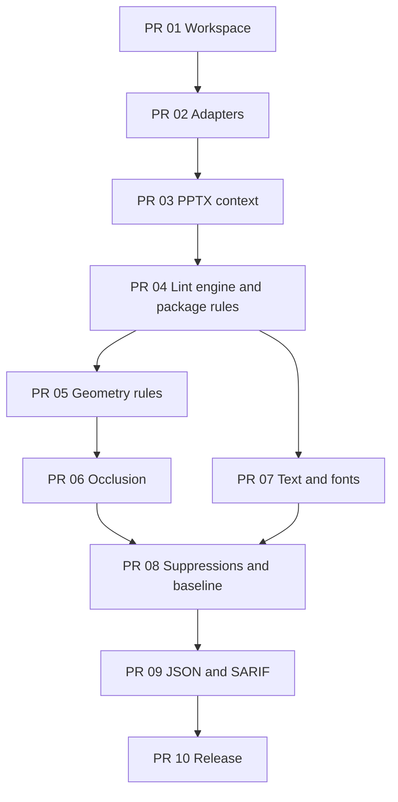

# План реализации по Pull Requests

## 1. Правила нарезки

V0.1 состоит из десяти последовательно mergeable PR. Каждый PR оставляет main в
зелёном состоянии, содержит tests/fixtures для своей функциональности и не
добавляет web/API/repair/renderer scope.

Размер reviewable source diff без lockfile/generated fixtures:

- **S** — до 350 строк;
- **M** — 350–700 строк;
- **L** — 700–1,200 строк.

PR больше 1,200 строк разделяется по adapter/model/rule boundary.

## 2. Сводка

|  PR | Title                                            | Размер | Результат                         |
| --: | ------------------------------------------------ | :----: | --------------------------------- |
|  01 | Bootstrap workspace and CI                       |   M    | собираемые core/CLI packages      |
|  02 | ZIP/XML adapters and fixture builder             |   L    | проверенные parser contracts      |
|  03 | OPC and PresentationML context                   |   L    | shared package/presentation model |
|  04 | Lint engine, config, package rules and CLI alpha |   L    | первая рабочая CLI-команда        |
|  05 | Geometry engine, outside-slide and text-overlap  |   L    | первые layout rules               |
|  06 | High-confidence text occlusion                   |   M    | z-order/opacity occlusion rule    |
|  07 | Text styles, autofit and font policy             |   L    | typography rules complete         |
|  08 | Suppressions and baseline mode                   |   M    | adoption на legacy decks          |
|  09 | JSON/SARIF and package UX                        |   M    | CI beta                           |
|  10 | Security, corpus calibration and v0.1 release    |   M    | release candidate                 |

## 3. Dependency graph



PR 06 и PR 07 можно готовить независимо после merge PR 05/PR 04 соответственно,
но оба должны войти до PR 08.

## 4. PR 01 — Bootstrap workspace and CI

Title:

```text
chore: bootstrap pptxlint workspace and CI
```

### Scope

- pnpm workspace, pinned package manager и Node 22;
- TypeScript strict, ESLint, Prettier, Vitest;
- `packages/core` и `packages/cli` skeletons;
- CLI binary wiring без lint functionality;
- root scripts и CI;
- package metadata: `private: true`, `license: UNLICENSED` до решения о релизе;
- `.gitignore`, `.editorconfig` и current README links.

### Merge criteria

- format/lint/typecheck/test/build проходят на clean checkout;
- CLI `--help` запускается;
- dependency direction CLI → core проверяется;
- нет Fastify/React/database/rendering dependencies.

### Non-goals

- ZIP/XML parsing;
- public npm publication;
- GitHub Action product integration.

## 5. PR 02 — ZIP/XML adapters and fixture builder

Title:

```text
feat(core): add safe ZIP and XML adapters with PPTX fixtures
```

### Scope

- internal ZIP reader interface с lazy entries и size metadata;
- duplicate entry visibility;
- namespace-aware XML parse adapter;
- strict malformed XML result;
- DTD/entity rejection;
- synthetic minimal PPTX builder;
- raw ZIP helper для intentionally invalid fixtures;
- ADR с library decision.

### Fixtures/tests

- minimal valid PPTX;
- duplicate ZIP name;
- truncated ZIP;
- malformed slide XML;
- DTD/entity XML;
- unknown XML extension preservation/readability.

### Merge criteria

- adapter contract tests не зависят от rules;
- duplicate names не молча overwrite-ятся;
- XML parser не выполняет filesystem/network resolution;
- fixture generator воспроизводим.

### Non-goals

- relationships/content types;
- config и findings;
- package mutation/writer.

## 6. PR 03 — OPC and PresentationML context

Title:

```text
feat(core): build safe OPC and PresentationML context
```

### Scope

- canonical part paths и traversal detection;
- `ArchiveIndex`, `XmlPartStore` и security limits;
- content-type index;
- root/part relationship resolution и graph;
- slide order и slide/layout/master/theme chain;
- local slide shape inventory и z-order;
- partial context/prerequisite diagnostics;
- SHA-256 и normalized input key.

### Tests

- relative relationship target matrix;
- external target no-fetch;
- nonsequential slide filenames;
- missing layout/master/media nodes;
- malformed relationship/content-types parts;
- read/parse cache counters;
- path traversal и size-limit cases.

### Merge criteria

- context не предполагает последовательные ZIP names;
- один malformed part не обрывает доступные indexes;
- один part читается/парсится максимум один раз;
- core не читает filesystem напрямую.

### Non-goals

- geometry transforms;
- rule IDs/findings;
- text style inheritance.

## 7. PR 04 — Lint engine, config, package rules and CLI alpha

Title:

```text
feat: add deterministic lint engine and package rules
```

### Scope

- finding/location/evidence/report contracts;
- deterministic fingerprint и sort;
- prerequisite-aware rule registry;
- JSON config schema и `recommended` preset;
- rule severity/options validation;
- exit policy 0/1/2;
- rules:
  - `package/broken-relationship`;
  - `package/missing-media`;
  - `package/malformed-xml`;
- minimal stylish CLI formatter.

### Fixtures/tests

- broken non-media relationship;
- missing image/audio/video target;
- malformed XML with partial report;
- external relationship;
- unknown rule/option config;
- deterministic output across repeated runs.

### Merge criteria

- `pptxlint fixture.pptx` работает end-to-end;
- missing media не дублируется broken-relationship finding;
- package finding содержит exact part/rId/target evidence;
- malformed XML не становится unexplained code 2;
- valid minimal fixture возвращает code 0.

### Non-goals

- layout/text/font rules;
- suppressions/baseline;
- JSON/SARIF public formatter.

После merge достигается **CLI alpha**.

## 8. PR 05 — Geometry engine, outside-slide and text-overlap

Title:

```text
feat(core): detect off-slide and overlapping text geometry
```

### Scope

- EMU affine matrix primitives;
- nested group transforms, scaling, flips и rotation;
- transformed polygons/bounds;
- polygon intersection/slide clipping;
- text-bearing shape model;
- `layout/outside-slide`;
- `layout/text-overlap`;
- config thresholds и evidence.

### Fixtures/tests

- basic/rotated/grouped off-slide shape;
- two text boxes below/at/above overlap threshold;
- intentional full-bleed background negative;
- canonical A/B pair identity;
- table/same-object exclusions;
- inherited master/layout decorations negative.

### Merge criteria

- group/rotation math проверяется pure unit tests;
- pair не создаётся дважды;
- evidence содержит bounds, intersection и ratio;
- error message не обещает rendered glyph collision.

### Non-goals

- opacity/z-order occlusion;
- slide rendering;
- automatic suppression heuristics.

## 9. PR 06 — High-confidence text occlusion

Title:

```text
feat(core): detect text occluded by opaque foreground shapes
```

### Scope

- z-order-aware candidate generation;
- solid-fill opacity evidence;
- JPEG opaque classification;
- PNG alpha-channel presence inspection;
- conservative unknown opacity state;
- `layout/text-occluded`;
- occluded text-frame ratio threshold.

### Fixtures/tests

- text under/over opaque solid shape;
- transparent/no-fill foreground negative;
- JPEG occluder;
- PNG with and without alpha;
- rotated/grouped occluder;
- partial/full text-frame coverage.

### Merge criteria

- unknown transparency не создаёт high-confidence finding;
- z-order учитывается;
- evidence объясняет opacity basis;
- rule называет text-frame coverage, не pixel-perfect hidden glyphs.

### Non-goals

- pixel alpha coverage;
- SVG/vector effect rendering;
- chart/SmartArt internals.

## 10. PR 07 — Text styles, autofit and font policy

Title:

```text
feat(core): lint effective text sizes, autofit, and allowed fonts
```

### Scope

- effective style resolver с provenance;
- run/paragraph/list/placeholder/layout/master inheritance;
- theme font resolution для script slots;
- title/body classification;
- stored autofit scale normalization;
- rules:
  - `text/min-font-size`;
  - `text/autofit-scale-below-minimum`;
  - `text/autofit-enabled`;
  - `fonts/allowed`.

### Fixtures/tests

- explicit/inherited sizes;
- title/body thresholds;
- stored scale below/above minimum;
- runtime autofit without usable scale;
- explicit/theme/mixed-script fonts;
- unresolved style/theme chain;
- no duplicate generic/autofit finding;
- no installed-font dependency.

### Merge criteria

- вычисленный size появляется только при resolved base + valid scale;
- runtime autofit получает uncertainty warning, не guessed point size;
- `fonts/allowed` off без allowlist;
- evidence содержит provenance.

### Non-goals

- text reflow simulation;
- font-file metrics/system inventory;
- font substitution.

После merge все десять v0.1 rules реализованы.

## 11. PR 08 — Suppressions and baseline mode

Title:

```text
feat: add exact suppressions and legacy-deck baselines
```

### Scope

- config `ignore` schema;
- exact rule/file/slide/shape/part matching;
- canonical pair IDs и optional reasons;
- suppression summary и unused metadata;
- baseline schema/write/read;
- new/existing/resolved classification;
- baseline-aware exit policy;
- incompatible-version errors.

### Tests

- exact suppression match/non-match;
- reversed shape pair order;
- suppressed finding absent from baseline;
- write → same deck = existing/code 0;
- add issue = new/code 1;
- remove issue = resolved;
- regenerated shape ID documented churn case;
- invalid baseline = code 2.

### Merge criteria

- baseline JSON детерминирован и не содержит slide text/absolute paths;
- only new findings gate CI;
- unused suppression видим, но не создаёт новый rule ID;
- processing order совпадает с product spec.

### Non-goals

- fuzzy baseline matching;
- speaker-notes/custom-metadata suppressions;
- remote baseline storage.

## 12. PR 09 — JSON/SARIF and package UX

Title:

```text
feat(cli): add JSON and SARIF CI output
```

### Scope

- final stylish formatter;
- versioned JSON schema/formatter;
- SARIF 2.1.0 rules/results;
- artifact URI, logical slide/shape locations и partial fingerprints;
- multi-file report aggregation;
- `--format`, `--output-file`, `--fail-on`;
- stdout/stderr discipline;
- packed-package install/execute test;
- README CI examples.

### Tests

- JSON schema validation и snapshots;
- SARIF schema/snapshots;
- Windows/POSIX path normalization;
- multi-file mixed code 0/1;
- machine output без ANSI;
- install tarball в temporary consumer project.

### Merge criteria

- `npx pptxlint deck.pptx` работает из packed local tarball;
- SARIF содержит все rule descriptors и logical locations;
- документация честно отмечает binary-artifact limitation;
- stdout содержит только выбранный format.

### Non-goals

- GitHub App/Check API;
- slide thumbnails/deep links;
- npm public publish.

После merge достигается **CI beta**.

## 13. PR 10 — Security, corpus calibration and v0.1 release

Title:

```text
chore: harden pptxlint and prepare v0.1 release
```

### Scope

- ZIP bomb/path traversal/DTD/external-target regression suite;
- actual-vs-declared byte limits;
- 50 MiB/100-slide performance benchmark;
- aggregate rule timings и peak RSS evidence;
- calibration минимум на 30 real decks из трёх source families;
- false-positive review и default severity/threshold adjustment;
- final docs, limitations и changelog;
- version `0.1.0` без public publication, если лицензия ещё не выбрана.

### Merge criteria

- all CI gates green на clean checkout;
- default error layout rules достигают целевого 90% precision на размеченном
  corpus либо сужены/понижены;
- proprietary decks не коммитятся;
- README содержит только executed commands;
- ни один v0.1 non-goal не появился скрыто;
- release evidence включает analyze examples, baseline flow и SARIF artifact.

### Non-goals

- новые rules;
- auto-fix;
- cloud/API/web/rendering;
- billing и organization features.

После merge достигается **v0.1 release candidate**.

## 14. PR 11 — Public beta distribution

Title:

```text
chore: prepare pptxlint for public beta distribution
```

PR 11 переводит private `v0.1.0` release candidate в публикуемый `v0.1.1`, не
добавляя product features. Canonical scope, release invariants, ручные
owner-only операции, registry smoke, 30-дневный adoption experiment и v0.2 gate
зафиксированы в [public-beta-plan.md](public-beta-plan.md).

### Merge criteria

- Apache-2.0 и public package metadata готовы;
- root workspace остаётся private;
- Node.js 22/24 matrix зелёная;
- packed manifests не содержат `workspace:*` и ссылаются на exact published
  `@pptxlint/core` version;
- tarballs содержат README/LICENSE/schemas и не содержат `.tsbuildinfo`;
- English README, три recipes и public broken-deck example проверяются в CI;
- release workflow готов к OIDC publication после manual prerelease bootstrap;
- исторический `v0.1.0` tag не изменяется и остаётся только в private archive.

### Non-goals

- новые rules;
- rendering/repair/web/API/App;
- Pro Engine;
- telemetry и billing.

После merge достигается **public-beta release readiness**. npm organization,
2FA, copyright-owner selection, manual `0.1.1-beta.0@next`, переключение
репозитория в public, trusted-publisher configuration и `v0.1.1@latest` являются
отдельными owner-operated release steps.

## 15. Rule ownership matrix

| Rule                               |  PR |
| ---------------------------------- | --: |
| `package/broken-relationship`      |  04 |
| `package/missing-media`            |  04 |
| `package/malformed-xml`            |  04 |
| `layout/outside-slide`             |  05 |
| `layout/text-overlap`              |  05 |
| `layout/text-occluded`             |  06 |
| `text/min-font-size`               |  07 |
| `text/autofit-scale-below-minimum` |  07 |
| `text/autofit-enabled`             |  07 |
| `fonts/allowed`                    |  07 |
| Suppressions/baseline              |  08 |
| JSON/SARIF                         |  09 |

## 16. Merge policy

- Каждый PR squash-mergerится с указанным conventional title.
- Rule не merge-ится без positive/negative/malformed-prerequisite fixtures.
- Config/report schema change обновляет schema tests и docs в том же PR.
- Geometry formula сопровождается pure unit tests и source/spec note.
- TODO допустим только вместе с conservative no-finding/no-guess behavior.
- Generated fixtures/snapshots воспроизводимы и не скрывают reviewable logic.
- Repair/API/web/rendering dependencies запрещены до завершения 30-дневного
  public-beta experiment и выбора evidence-backed направления v0.2.

## 17. PR evidence template

Каждый PR показывает:

1. зачем изменение нужно пользователю или следующему architectural layer;
2. exact scope и explicit non-goals;
3. test commands и результаты;
4. fixture before/expected finding;
5. OOXML/spec basis для нового parsing/geometry behavior;
6. determinism/security/false-positive risks;
7. CLI output, если PR меняет user-visible behavior.
