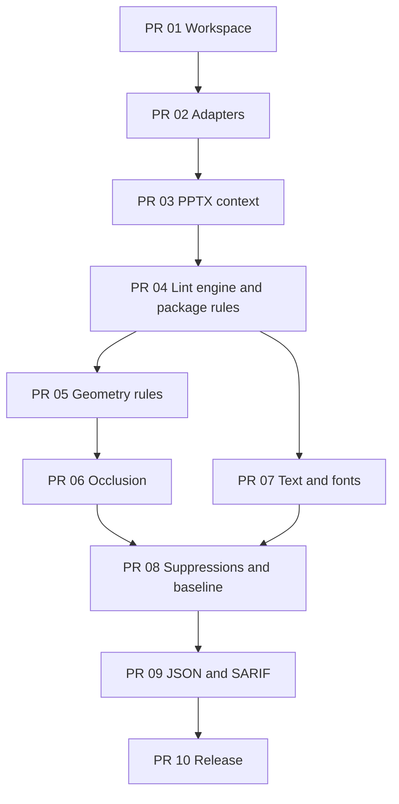

# Implementation plan by Pull Request

## 1. Breakdown rules

V0.1 consists of ten sequentially mergeable PRs. Each PR leaves main green,
includes tests/fixtures for its functionality, and introduces no
web/API/repair/renderer scope.

Reviewable source diff size, excluding the lockfile/generated fixtures:

- **S** — up to 350 lines;
- **M** — 350–700 lines;
- **L** — 700–1,200 lines.

PRs exceeding 1,200 lines are split at adapter/model/rule boundaries.

## 2. Overview

|  PR | Title                                            | Size | Outcome                           |
| --: | ------------------------------------------------ | :--: | --------------------------------- |
|  01 | Bootstrap workspace and CI                       |  M   | buildable core/CLI packages       |
|  02 | ZIP/XML adapters and fixture builder             |  L   | verified parser contracts         |
|  03 | OPC and PresentationML context                   |  L   | shared package/presentation model |
|  04 | Lint engine, config, package rules and CLI alpha |  L   | first working CLI command         |
|  05 | Geometry engine, outside-slide and text-overlap  |  L   | first layout rules                |
|  06 | High-confidence text occlusion                   |  M   | z-order/opacity occlusion rule    |
|  07 | Text styles, autofit and font policy             |  L   | typography rules complete         |
|  08 | Suppressions and baseline mode                   |  M   | adoption for legacy decks         |
|  09 | JSON/SARIF and package UX                        |  M   | CI beta                           |
|  10 | Security, corpus calibration and v0.1 release    |  M   | release candidate                 |

## 3. Dependency graph



PR 06 and PR 07 can be prepared independently after PR 05 and PR 04 are merged,
respectively, but both must be merged before PR 08.

## 4. PR 01 — Bootstrap workspace and CI

Title:

```text
chore: bootstrap pptxlint workspace and CI
```

### Scope

- pnpm workspace, pinned package manager, and Node 22;
- TypeScript strict, ESLint, Prettier, Vitest;
- `packages/core` and `packages/cli` skeletons;
- CLI binary wiring without lint functionality;
- root scripts and CI;
- package metadata: `private: true`, `license: UNLICENSED` until the release decision;
- `.gitignore`, `.editorconfig`, and current README links.

### Merge criteria

- format/lint/typecheck/test/build pass on a clean checkout;
- CLI `--help` runs;
- dependency direction CLI → core is verified;
- no Fastify/React/database/rendering dependencies.

### Non-goals

- ZIP/XML parsing;
- public npm publication;
- GitHub Action product integration.

## 5. PR 02 — ZIP/XML adapters and fixture builder

Title:

```text
feat(core): add safe ZIP and XML adapters with PPTX fixtures
```

### Scope

- internal ZIP reader interface with lazy entries and size metadata;
- duplicate entry visibility;
- namespace-aware XML parse adapter;
- strict malformed XML result;
- DTD/entity rejection;
- synthetic minimal PPTX builder;
- raw ZIP helper for intentionally invalid fixtures;
- ADR documenting the library decision.

### Fixtures/tests

- minimal valid PPTX;
- duplicate ZIP name;
- truncated ZIP;
- malformed slide XML;
- DTD/entity XML;
- unknown XML extension preservation/readability.

### Merge criteria

- adapter contract tests are independent of rules;
- duplicate names are not silently overwritten;
- the XML parser performs no filesystem/network resolution;
- fixture generation is reproducible.

### Non-goals

- relationships/content types;
- config and findings;
- package mutation/writer.

## 6. PR 03 — OPC and PresentationML context

Title:

```text
feat(core): build safe OPC and PresentationML context
```

### Scope

- canonical part paths and traversal detection;
- `ArchiveIndex`, `XmlPartStore`, and security limits;
- content-type index;
- root/part relationship resolution and graph;
- slide order and slide/layout/master/theme chain;
- local slide shape inventory and z-order;
- partial context/prerequisite diagnostics;
- SHA-256 and normalized input key.

### Tests

- relative relationship target matrix;
- external target no-fetch;
- nonsequential slide filenames;
- missing layout/master/media nodes;
- malformed relationship/content-types parts;
- read/parse cache counters;
- path traversal and size-limit cases.

### Merge criteria

- context does not assume sequential ZIP names;
- one malformed part does not interrupt available indexes;
- each part is read/parsed at most once;
- core does not read the filesystem directly.

### Non-goals

- geometry transforms;
- rule IDs/findings;
- text style inheritance.

## 7. PR 04 — Lint engine, config, package rules and CLI alpha

Title:

```text
feat: add deterministic lint engine and package rules
```

### Scope

- finding/location/evidence/report contracts;
- deterministic fingerprints and sorting;
- prerequisite-aware rule registry;
- JSON config schema and `recommended` preset;
- rule severity/options validation;
- exit policy 0/1/2;
- rules:
  - `package/broken-relationship`;
  - `package/missing-media`;
  - `package/malformed-xml`;
- minimal stylish CLI formatter.

### Fixtures/tests

- broken non-media relationship;
- missing image/audio/video target;
- malformed XML with partial report;
- external relationship;
- unknown rule/option config;
- deterministic output across repeated runs.

### Merge criteria

- `pptxlint fixture.pptx` works end-to-end;
- missing media does not produce a duplicate broken-relationship finding;
- package findings contain exact part/rId/target evidence;
- malformed XML does not become an unexplained code 2;
- a valid minimal fixture returns code 0.

### Non-goals

- layout/text/font rules;
- suppressions/baseline;
- JSON/SARIF public formatter.

Merging this PR achieves **CLI alpha**.

## 8. PR 05 — Geometry engine, outside-slide and text-overlap

Title:

```text
feat(core): detect off-slide and overlapping text geometry
```

### Scope

- EMU affine matrix primitives;
- nested group transforms, scaling, flips, and rotation;
- transformed polygons/bounds;
- polygon intersection/slide clipping;
- text-bearing shape model;
- `layout/outside-slide`;
- `layout/text-overlap`;
- config thresholds and evidence.

### Fixtures/tests

- basic/rotated/grouped off-slide shape;
- two text boxes below/at/above overlap threshold;
- intentional full-bleed background negative;
- canonical A/B pair identity;
- table/same-object exclusions;
- inherited master/layout decorations negative.

### Merge criteria

- group/rotation math is verified by pure unit tests;
- pairs are not created twice;
- evidence includes bounds, intersection, and ratio;
- error messages do not claim rendered glyph collisions.

### Non-goals

- opacity/z-order occlusion;
- slide rendering;
- automatic suppression heuristics.

## 9. PR 06 — High-confidence text occlusion

Title:

```text
feat(core): detect text occluded by opaque foreground shapes
```

### Scope

- z-order-aware candidate generation;
- solid-fill opacity evidence;
- JPEG opaque classification;
- PNG alpha-channel presence inspection;
- conservative unknown opacity state;
- `layout/text-occluded`;
- occluded text-frame ratio threshold.

### Fixtures/tests

- text under/over opaque solid shape;
- transparent/no-fill foreground negative;
- JPEG occluder;
- PNG with and without alpha;
- rotated/grouped occluder;
- partial/full text-frame coverage.

### Merge criteria

- unknown transparency does not produce a high-confidence finding;
- z-order is respected;
- evidence explains the opacity basis;
- the rule describes text-frame coverage rather than pixel-perfect hidden glyphs.

### Non-goals

- pixel alpha coverage;
- SVG/vector effect rendering;
- chart/SmartArt internals.

## 10. PR 07 — Text styles, autofit and font policy

Title:

```text
feat(core): lint effective text sizes, autofit, and allowed fonts
```

### Scope

- effective style resolver with provenance;
- run/paragraph/list/placeholder/layout/master inheritance;
- theme font resolution for script slots;
- title/body classification;
- stored autofit scale normalization;
- rules:
  - `text/min-font-size`;
  - `text/autofit-scale-below-minimum`;
  - `text/autofit-enabled`;
  - `fonts/allowed`.

### Fixtures/tests

- explicit/inherited sizes;
- title/body thresholds;
- stored scale below/above minimum;
- runtime autofit without usable scale;
- explicit/theme/mixed-script fonts;
- unresolved style/theme chain;
- no duplicate generic/autofit finding;
- no installed-font dependency.

### Merge criteria

- computed size appears only with a resolved base + valid scale;
- runtime autofit produces an uncertainty warning rather than a guessed point size;
- `fonts/allowed` is off without an allowlist;
- evidence includes provenance.

### Non-goals

- text reflow simulation;
- font-file metrics/system inventory;
- font substitution.

After merging, all ten v0.1 rules are implemented.

## 11. PR 08 — Suppressions and baseline mode

Title:

```text
feat: add exact suppressions and legacy-deck baselines
```

### Scope

- config `ignore` schema;
- exact rule/file/slide/shape/part matching;
- canonical pair IDs and optional reasons;
- suppression summary and unused metadata;
- baseline schema/write/read;
- new/existing/resolved classification;
- baseline-aware exit policy;
- incompatible-version errors.

### Tests

- exact suppression match/non-match;
- reversed shape pair order;
- suppressed finding absent from baseline;
- write → same deck = existing/code 0;
- add issue = new/code 1;
- remove issue = resolved;
- regenerated shape ID documented churn case;
- invalid baseline = code 2.

### Merge criteria

- baseline JSON is deterministic and excludes slide text/absolute paths;
- only new findings gate CI;
- unused suppressions are visible without introducing a new rule ID;
- processing order matches the product specification.

### Non-goals

- fuzzy baseline matching;
- speaker-notes/custom-metadata suppressions;
- remote baseline storage.

## 12. PR 09 — JSON/SARIF and package UX

Title:

```text
feat(cli): add JSON and SARIF CI output
```

### Scope

- final stylish formatter;
- versioned JSON schema/formatter;
- SARIF 2.1.0 rules/results;
- artifact URI, logical slide/shape locations, and partial fingerprints;
- multi-file report aggregation;
- `--format`, `--output-file`, `--fail-on`;
- stdout/stderr discipline;
- packed-package install/execute test;
- README CI examples.

### Tests

- JSON schema validation and snapshots;
- SARIF schema/snapshots;
- Windows/POSIX path normalization;
- multi-file mixed code 0/1;
- machine output without ANSI;
- tarball installation in a temporary consumer project.

### Merge criteria

- `npx pptxlint deck.pptx` works from a packed local tarball;
- SARIF contains all rule descriptors and logical locations;
- documentation clearly states the binary-artifact limitation;
- stdout contains only the selected format.

### Non-goals

- GitHub App/Check API;
- slide thumbnails/deep links;
- npm public publish.

Merging this PR achieves **CI beta**.

## 13. PR 10 — Security, corpus calibration and v0.1 release

Title:

```text
chore: harden pptxlint and prepare v0.1 release
```

### Scope

- ZIP bomb/path traversal/DTD/external-target regression suite;
- actual-vs-declared byte limits;
- 50 MiB/100-slide performance benchmark;
- aggregate rule timings and peak RSS evidence;
- calibration on at least 30 real decks from three source families;
- false-positive review and default severity/threshold adjustment;
- final docs, limitations, and changelog;
- version `0.1.0` without public publication if the license has not yet been selected.

### Merge criteria

- all CI gates pass on a clean checkout;
- default error layout rules achieve the target 90% precision on the labeled
  corpus or are narrowed/downgraded;
- proprietary decks are not committed;
- README contains only executed commands;
- no v0.1 non-goals have been introduced implicitly;
- release evidence includes analysis examples, baseline flow, and a SARIF artifact.

### Non-goals

- new rules;
- auto-fix;
- cloud/API/web/rendering;
- billing and organization features.

Merging this PR achieves a **v0.1 release candidate**.

## 14. PR 11 — Public beta distribution

Title:

```text
chore: prepare pptxlint for public beta distribution
```

PR 11 takes the private `v0.1.0` release candidate to a publishable `v0.1.1`
without adding product features. Canonical scope, release invariants, manual
owner-only operations, registry smoke, the 30-day adoption experiment, and the
v0.2 gate are defined in [public-beta-plan.md](public-beta-plan.md).

### Merge criteria

- Apache-2.0 and public package metadata are ready;
- the root workspace remains private;
- the Node.js 22/24 matrix passes;
- packed manifests contain no `workspace:*` references and use the exact published
  `@pptxlint/core` version;
- tarballs include README/LICENSE/schemas and exclude `.tsbuildinfo`;
- the English README, three recipes, and public broken-deck example are verified in CI;
- the release workflow is ready for OIDC publication after manual prerelease bootstrap;
- the historical `v0.1.0` tag remains unchanged and exists only in the private archive.

### Non-goals

- new rules;
- rendering/repair/web/API/App;
- Pro Engine;
- telemetry and billing.

Merging this PR achieves **public-beta release readiness**. The npm organization,
2FA, copyright-owner selection, manual `0.1.1-beta.0@next`, making the repository
public, trusted-publisher configuration, and `v0.1.1@latest` are separate
owner-operated release steps.

## 15. Rule ownership matrix

| Rule                               |  PR |
| ---------------------------------- | --: |
| `package/broken-relationship`      |  04 |
| `package/missing-media`            |  04 |
| `package/malformed-xml`            |  04 |
| `layout/outside-slide`             |  05 |
| `layout/text-overlap`              |  05 |
| `layout/text-occluded`             |  06 |
| `text/min-font-size`               |  07 |
| `text/autofit-scale-below-minimum` |  07 |
| `text/autofit-enabled`             |  07 |
| `fonts/allowed`                    |  07 |
| Suppressions/baseline              |  08 |
| JSON/SARIF                         |  09 |

## 16. Merge policy

- Each PR is squash-merged with the specified conventional title.
- Rules are not merged without positive/negative/malformed-prerequisite fixtures.
- Config/report schema changes update schema tests and docs in the same PR.
- Geometry formulas include pure unit tests and a source/spec note.
- TODOs are allowed only with conservative no-finding/no-guess behavior.
- Generated fixtures/snapshots are reproducible and do not conceal reviewable logic.
- Repair/API/web/rendering dependencies are prohibited until the 30-day
  public-beta experiment is complete and an evidence-backed v0.2 direction is selected.

## 17. PR evidence template

Each PR shows:

1. why the user or next architectural layer needs the change;
2. exact scope and explicit non-goals;
3. test commands and results;
4. fixture before/expected finding;
5. the OOXML/spec basis for new parsing/geometry behavior;
6. determinism/security/false-positive risks;
7. CLI output when the PR changes user-visible behavior.
